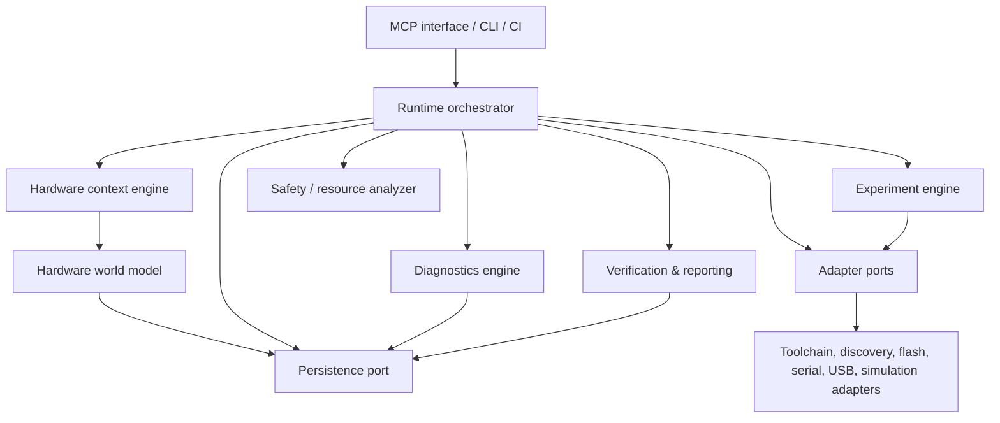

# System boundary and high-level architecture

## Responsibility matrix

| Concern | HAR | External AI agent | User | Platform/toolchain |
|---|---|---|---|---|
| Interpret goal and choose tests | provides facts/options | **owns** | answers requests | — |
| Hardware model and project state | validates, persists, reconciles | proposes updates | confirms physical facts | exposes discovered facts |
| Firmware source | accepts immutable submission | **creates/chooses** | may provide | compiles it |
| Compile/flash/reset | orchestrates and records | requests | connects hardware/approves risks | executes commands |
| USB/serial observation | captures, timestamps, normalizes | consumes evidence | may reconnect hardware | emits events/data |
| Diagnostics and reports | evaluates deterministic rules | interprets/remediates | performs requested actions | supplies raw outcomes |
| Electrical safety gate | checks declared constraints; blocks unsafe ops | supplies plan | supplies wiring facts | — |
| Human actions | requests/resumes/records response | explains request | **performs and responds** | — |

HAR explicitly does not reason from natural language, generate firmware, select a product design, claim an unobserved physical fact as verified, bypass safety blockers, control mains/high-energy equipment in v1, or host cloud/LLM services.

## Layers and dependency direction

Dependencies point inward: interface and adapters depend on core ports; core never imports Arduino CLI code. Event delivery is one-way through an append-only runtime event log. The orchestrator is the sole command coordinator; it is not a second state store.

## Module contracts

| Module | Purpose; inputs → outputs | Owned state | Dependencies | Public interface | Failure / must not do |
|---|---|---|---|---|---|
| MCP interface | validated tool requests → envelopes | request correlation only | orchestrator, schemas | `call(tool,input)` | `INVALID_REQUEST`; never call adapters directly |
| Runtime orchestrator | commands/events → transition result/events | operation leases, idempotency keys | ports, state machines | `compile`, `flashObserve`, `run`, `resume` | `CONFLICT`, `CANCELLED`; never infer wiring |
| Context engine | observations + confirmations → `HardwareContext` | context revision | world model, discovery | `reconcile`, `get` | stale context; never compile/flash |
| World model | model patches → validated graph | project model/revision | schema, persistence | `applyPatch`, `snapshot` | graph conflict; never mutate raw evidence |
| Toolchain service | firmware ref/config → artifact/result | process handle only | ToolchainAdapter | `compile` | tool unavailable/compile error; never change project state |
| Discovery service | adapter scans → descriptors/port events | current scan cache | board/USB adapters | `scan`, `resolveBoard` | ambiguity; never choose silently |
| Flash service | artifact/device → flash result | exclusive device lease | FlashAdapter, USB monitor | `flash` | interrupted flash; never erase outside declared target |
| Serial capture | port bytes → observations | capture sessions/ring policy | SerialAdapter | `start`, `stop`, `window` | baud/open failure; never parse as facts |
| USB link monitor | USB events → observations | current link state | UsbMonitorAdapter | `watch`, `snapshot` | monitor failure; never flash |
| Diagnostics engine | observations/rules → findings | rule-set version | rule registry | `evaluate` | malformed rule; never hide evidence |
| Driver registry | driver manifests → resolvable definitions | installed manifests | persistence/schema | `resolve`, `list` | incompatible driver; never load executable code in v1 |
| Experiment engine | definition/context → run/events | run cursor, variables | orchestrator ports | `start`, `resume`, `abort` | timeout/assertion; never execute prose |
| Human-in-loop | action spec → request/response | pending request token | persistence | `request`, `respond` | expired/mismatched response; never assume success |
| Simulation backend | experiment/model → synthetic observations | simulation state | SimulationAdapter | `simulate` | unsupported component; never represent physical verification |
| Resource analyzer | model/board → resource report | none | board/driver metadata | `analyze` | insufficient/conflict; never allocate pins |
| Verification/reporting | evidence/findings → reports | report revision | persistence | `verify`, `render` | missing evidence; never upgrade confidence |
| Persistence | typed aggregates/events → durable records | database | SQLite adapter | transactions, queries | IO/migration; never implement policy |
| Hardware CI runner | CI selection → report/artifacts | run workspace | orchestrator | `runCi` | unavailable hardware; never require interactive human step |

The named services may be implemented as core modules rather than network services. Each has one writer: project/world changes through World Model; run changes through Experiment Engine; durable writes through Persistence.
