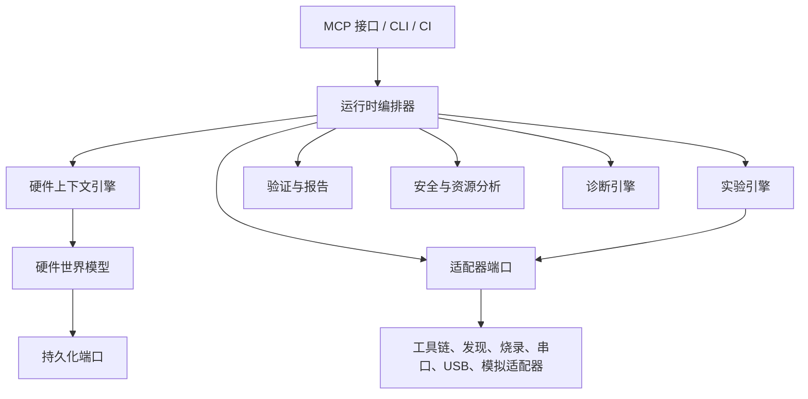

# 系统边界与高层架构

## 职责边界

| 事项 | HAR | 外部 AI Agent | 用户 | 平台/工具链 |
|---|---|---|---|---|
| 理解目标、选择测试 | 提供事实和选项 | **负责** | 回答请求 | — |
| 硬件模型与项目状态 | 验证、持久化、协调 | 提议更新 | 确认物理事实 | 暴露发现事实 |
| 固件源码 | 接收不可变提交 | **创建/选择** | 可提供 | 编译 |
| 编译、烧录、复位 | 编排并记录 | 请求 | 连接硬件/确认风险 | 执行命令 |
| USB 与串口观察 | 捕获、加时间戳、归一化 | 消费证据 | 可重新连接硬件 | 产生事件/数据 |
| 诊断与报告 | 执行确定性规则 | 解释并修复 | 执行要求的动作 | 提供原始结果 |

HAR 明确不做自然语言推理、不生成固件、不替用户选择产品设计、不把未观察的物理事实标为已验证、不绕过安全阻止项，也不在 v1 控制市电或高能设备。

## 分层与依赖方向

依赖只向内：接口和适配器依赖 Core 的端口；Core 不导入 Arduino CLI 代码。事件通过追加式日志单向传递，编排器是唯一的命令协调者。

## 模块规则

MCP 层只验证并转发请求；编排器拥有幂等键与操作租约；上下文引擎构造紧凑快照；世界模型拥有项目图；工具链、发现、烧录、串口和 USB 服务仅经适配器访问外界；诊断只从原始观察产生带证据引用的发现；驱动注册表只加载声明式元数据；实验引擎拥有运行光标；人工操作服务拥有待处理请求；模拟绝不冒充真实验证；资源分析器只报告冲突和安全项；报告服务不提高证据置信度；持久化层是唯一的 durable writer。

所有模块都不得越权：例如 MCP 不直接调用适配器、诊断不隐藏证据、实验不执行自然语言、烧录服务不擦除声明目标以外的设备。
